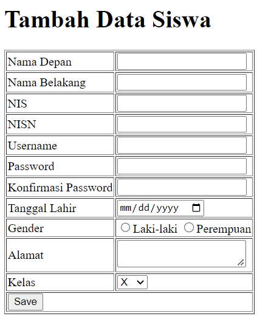
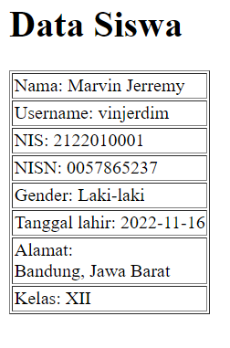

# Exercises

Buatlah file-file berikut di folder `perpustakaan`

## 1. Form Create Student
a. Buat file `form_create_user.php` yang menampilkan hal berikut ini 
 
b. Buat file `result_user.php` yang menampilkan hal berikut ini dari form di atas 
 