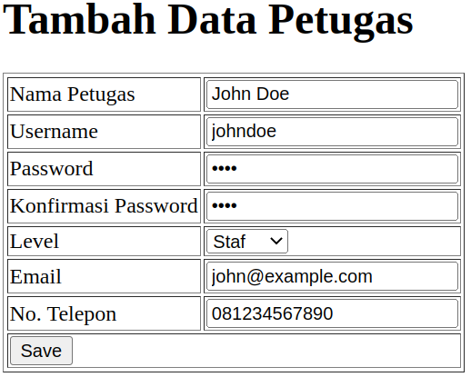
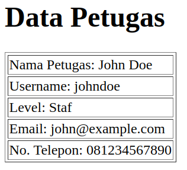
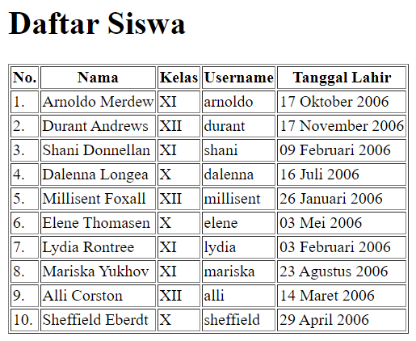
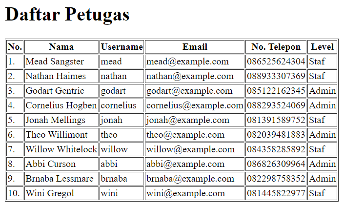

# Exercises

Buatlah file-file berikut di folder `perpustakaan`

## 1. Form Tambah Siswa
a. Buat file `form_create_user.php` yang menampilkan hal berikut ini 
 
b. Buat file `result_user.php` yang menampilkan hal berikut ini dari form di atas 
 

## 2. Form Tambah Petugas
a. Buat file `form_create_staff.php` yang menampilkan hal berikut ini 
Keterangan: Untuk level ada `Staf` dan `Admin` 
 
b. Buat file `result_staff.php` yang menampilkan hal berikut ini dari form di atas 
 

## 3. Tabel Siswa
a. Buat file `table_user.php` yang menampilkan tabel berikut ini 
Keterangan: tidak perlu menggunakan `<form>` 
 

## 4. Tabel Petugas
a. Buat file `table_staff.php` yang menampilkan tabel berikut ini 
Keterangan: tidak perlu menggunakan `<form>` 
 
