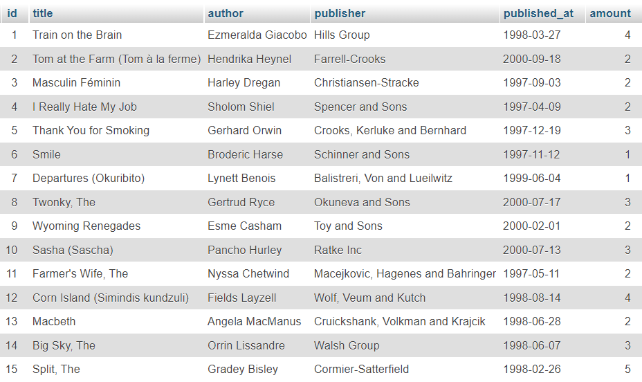

# Exercises

Buatlah file-file berikut di folder `perpustakaan`

## 1. Database
a. Buka phpmyadmin dan buat database dengan nama `library_<nama_kamu>` (contoh: `library_marvin`) 
b. Buat table `books` dengan isi sebagai berikut 
 

## 2. Query
a. Buka [GForm ini](https://forms.gle/e8CZUMC8bVjMogGc6), lalu tuliskan kalimat SQL untuk melakukan hal-hal berikut ini: 
1. Menampilkan 5 judul buku yang jumlahnya paling banyak 
2. Menampilkan nama pengarang dan penerbit yang bukunya terbit di tahun 1997 
3. Menampilkan total buku yang terbit sesudah tahun 1998 
4. Memasukkan buku "There's Something About Mary", dikarang oleh "Ebeneser Pray", diterbitkan oleh "Jerde-Rolfson", pada 19 Juli 1999, sejumlah 2 buku 
5. Memasukkan buku "Spiral", dikarang oleh "Jay Hardware", diterbitkan oleh "Schowalter Inc", pada 20 Desember 1997, sejumlah 4 buku 
6. Memasukkan buku "Mercy Streets", dikarang oleh "Jobi Gorrick", diterbitkan oleh "Lang LLC", pada 07 Oktober 1999, sejumlah 4 buku 
7. Mengubah jumlah buku yang terbit pada tahun 1999 menjadi 1 saja 
8. Mengubah nama pengarang menjadi "Juliana Gullen" dan tanggal terbit jadi 22 Desember 1997 untuk buku "Wyoming Renegades" 
9. Menghapus buku yang terbit di bulan Desember 1997 
10. Menghapus buku yang dikarang Gertrud atau Harley 
