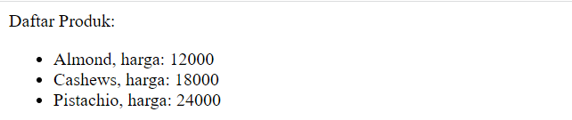

# Exercises

Baca setiap instruksi dengan teliti!
Kumpulkan latihan-latihan berikut ini di [form berikut](https://forms.gle/Fu9VWWrTtq4UWsMt5)

## 1. Basic HTML
1. Buka halaman [0_basic_html](./0_basic_html)
2. Isi file `basic.html` agar bisa menampilkan formulir berikut ini 

## 2. HTML & PHP
1. Buka halaman [1_merge_html_and_php](./1_merge_html_and_php)
2. Lengkapi isi file `basic.php` agar bisa menampilkan halaman berikut ini 
 
*Catatan: wajib menggunakan `$product_names` dan `$product_prices`*
